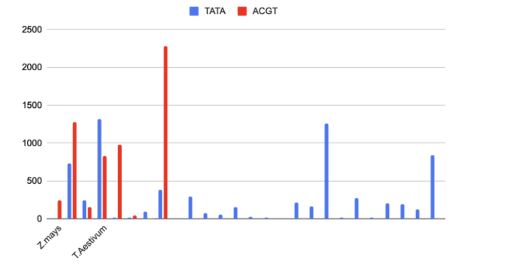

Research was conducted to check if ACGT occurrences are higher in genes known to be responsible for stress response. Two genes MAPK1 for Triticum aestivum and GLK44 for Zea mays which are known to be stress responsive genes were analysed. By writing a few codes and using fasta files of both genes, we analysed the number of ACGT occurrences in both of them and the distances between each occurrence.

The code takes user’s input to recognise the fasta file wanted by the user. The code then asks the user which cis regulatory element the user wishes to identify in the gene sequence.
Please note that the limit for recognising the sequence can exceed the 4 numbers of characters (i.e, you can recognise any piece of sequence with no limit on the number of nucleotides)

Upon the user’s input of the data file location and sequence wished to be analysed the code runs. The code then prints the number of times the desired sequence has appeared in the gene and the spacer length between two consecutive occurrences of the element.

The fasta files for both T.aestivum and Z.mays stress genes were taken up from an ncbi database available on the internet.
The occurrences of “ACGT” and “TATA” were analysed.

In the gene MAPK1: There were 24 occurrences of “TATA” and only 6 occurrences of “ACGT”. There were 7 occurrences with spacer length<25 for “TATA” and only occurrence for “ACGT with a spacer length <25 bp.

In the gene GKL44: There are 4 occurrences of “ACGT” and “TATA” each. None of the occurrences have a spacer length below 25 except for one time where two cis-regulatory TATA sequences had a spacer length of 1 bp.

I zeroed in on specific DNA sequences within CREs, particularly those containing the ACGT motif. 

This sequence appears frequently in the promoter regions, the DNA sequences flanking a gene that act as recognition sites for transcription of stress-responsive genes. These motifs are believed to be binding sites for transcription factors, specialised proteins that act as molecular switches, turning genes on or off.

To understand how the number and spacing of these CREs influence gene activation, we analysed the promoter regions of the target genes. This involved counting the number of times a specific sequence, like ACGT, appeared (number) and measuring the number of nucleotides (the building blocks of DNA) separating each instance (spacing)

An analysis of cis-regulatory elements in MAPK1 revealed a higher frequency of "TATA" motifs (24 occurrences) compared to "ACGT" (6 occurrences). Interestingly, most "TATA" and “ACGT” motifs had longer spacer lengths (>25 bp). Conversely, in GKL44, both "ACGT" and "TATA" motifs occurred with equal frequency (4 each). Notably, all but a single "TATA" motif (spacer length 1 bp) displayed spacer lengths exceeding 25 bp.
