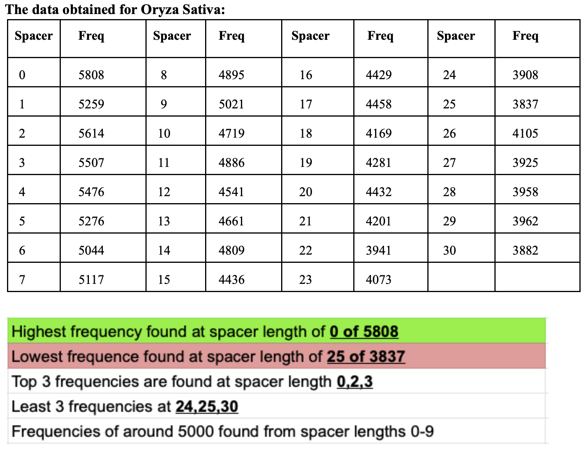
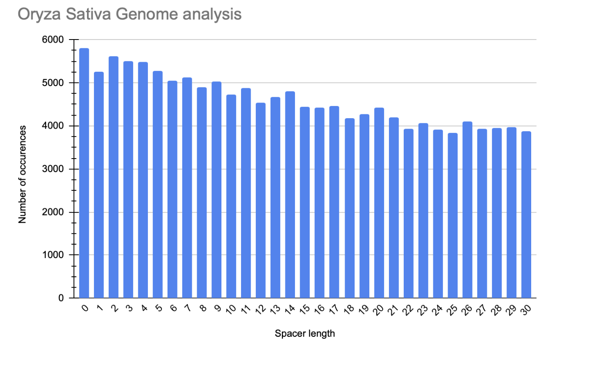

For entire genome analysis, We analysed the frequency of **GATA AAAG** sequence while increasing the spacer length from 0-30

Entire genomes of Oryza Sativa were obtained.
Entire genomes are available in the fastq format so there were several stages of complex codes needed for conversion and output of usable data.

**The data obtained for Oryza Sativa:**

in rice (Oryza sativa), I analysed the frequency of two other motifs, GATA and AAAG. 

Notably, I discovered that these motifs appeared most frequently with no spacer nucleotides separating them (spacer length 0) in the promoter regions of genes expressed under normal conditions. 

**This suggests a potential role for closely positioned CREs in regulating gene expression.**

