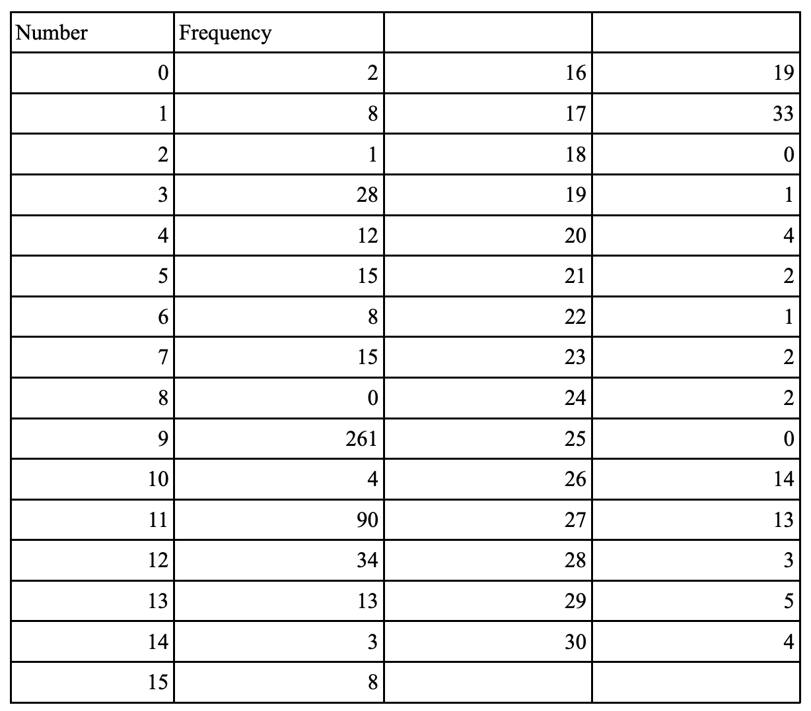

The next step was to analyse these genomes under salt stress.
We analysed the **Arabidopsis** genome under **salinity stress** for the **CATGTG motif**

CATGTG is one motif
CATGTGNCATGTG
CATGTGNNCATGTG
And so we can increase the 'N' spacer from 0-30

Thus similar codes with changes necessary for a more than 4 nucleotide sequences were written by me and Arabidopsis was analysed

In the model plant Arabidopsis thaliana, I aimed to identify the maximum observed spacer length between another CRE motif, CATGTG, under salt stress. 

This essentially means I looked for the furthest distance observed between two instances of this sequence within the promoter region of genes activated during salt stress. 

I found that the maximum spacer length for CATGTG under salt stress was 9 nucleotides.
