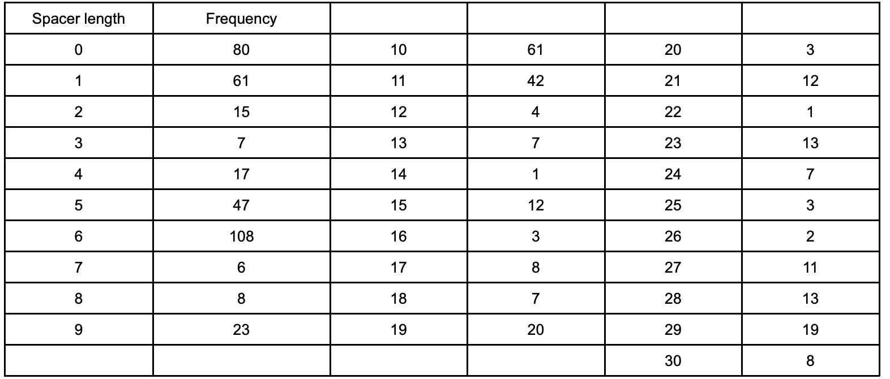
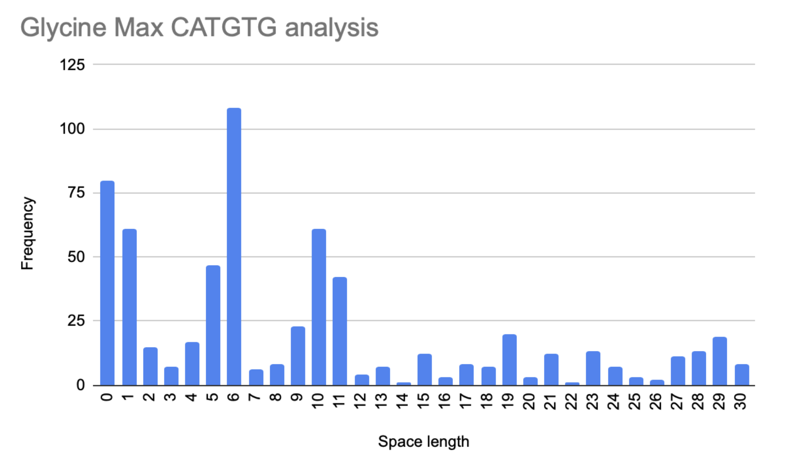

Then analysis of the genome of Glycine max, **12 hours after salinity stress was induced for the CATGTG motif.** 

The CATGTG motif might bind with stress response proteins, turning on genes important for early salt tolerance. 

By looking for these motifs near genes upregulated at 12 hours, we can identify potential players in the soybean's initial defence against salinity. 

We can see that the most common spacer length is 6.

